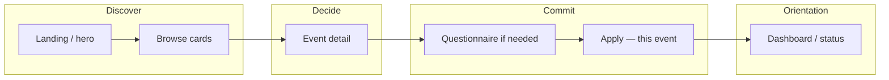
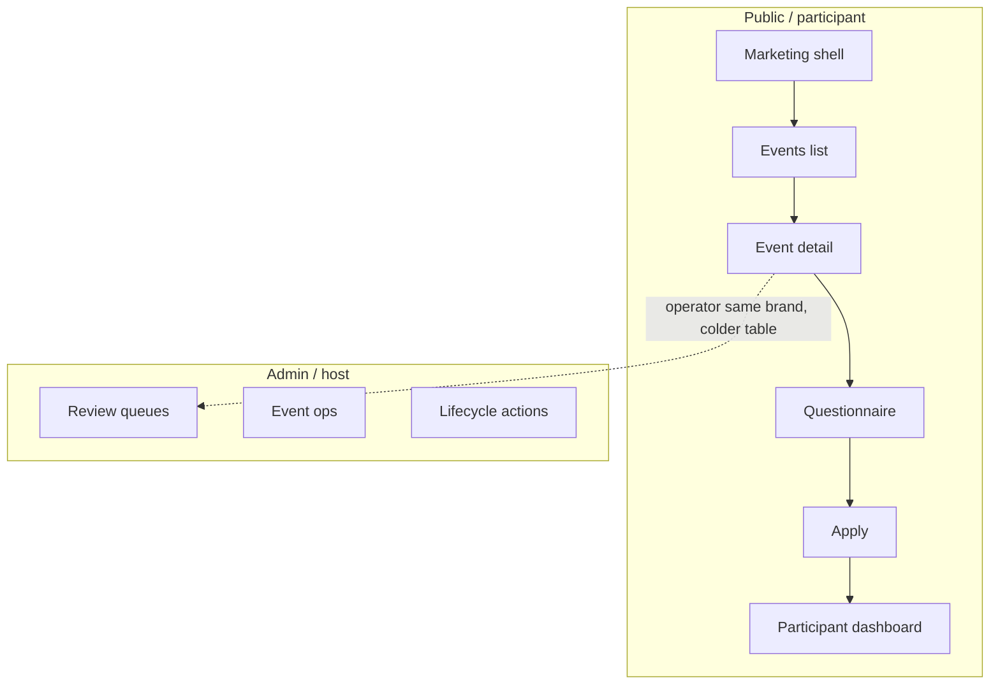

# Design vision — visual companion (Circles / Social Matching MVP)

**Date:** 2026-04-21  
**Status:** Design track — step-by-step imagination aid; not a replacement for `docs/mvp-v1/12_DESIGN_AND_UX_PRINCIPLES.md`  
**Canonical UX law:** [`docs/mvp-v1/12_DESIGN_AND_UX_PRINCIPLES.md`](../../mvp-v1/12_DESIGN_AND_UX_PRINCIPLES.md)

---

## 1. How to use this doc (comfortable step-by-step)

Advance **one step at a time**. After each step, decide “yes / adjust / park” before moving on.

| Step | You look at | You decide |
|------|-------------|------------|
| **D1 — Atmosphere** | Token board + HTML mood page | “Does this feel warm, calm, quietly premium?” — aligns §1–3 of doc 12 |
| **D2 — Browse shape** | ASCII “Events” + optional map note | Feed-first vs hero+list (see progress spec §5.1) |
| **D3 — Detail story** | ASCII “Event detail” | What one screen must always explain (trust + next step) |
| **D4 — Apply moment** | ASCII “Apply” | How little friction you can keep while staying event-specific |
| **D5 — Admin contrast** | ASCII “Admin” | Enough precision without leaking cold voice to participants |

**Browser mood board (opens locally):** [`docs/design/visual-language-board.html`](../../design/visual-language-board.html) — color, type, and tiny fake UI blocks so you can *see* direction without building the app.

---

## 2. North star (from doc 12, plain language)

| The product should feel | The product should not feel |
|-------------------------|----------------------------|
| Warm, calm, human | Corporate, cold ops |
| Intentional, trustworthy | Marketplace “deals”, dating-app vibes |
| Quietly premium | Growth hacks, pressure |

**Participant surfaces:** thoughtful host, editorial, inviting — doc 12 §2, §4.  
**Admin surfaces:** cleaner, less moody, still on-brand — doc 12 §5.

---

## 3. Visual tokens (aligned to live Circles)

**Production reference (palette + RTL shell):** [circles-connect-human.vercel.app](https://circles-connect-human.vercel.app/) — use this as the **canonical color story** for `social-matching-web` so marketing, mood boards, and product MVP feel like **one family**.

Extracted / confirmed from the deployed bundle (light mode bootstrap + Tailwind utilities):

| Token | Role | Example (hex) | Note |
|-------|------|---------------|------|
| Background warm | Page wash | `#f7f3ea` | Appears across UI blocks on the live site |
| Background neutral | Shell / fallback | `#f9f9f9` | Early `theme-color` / bootstrap background on the same site |
| Surface / card | Rounded lift | `#fffefc` (or pure `#fff`) | Keeps cards readable on warm wash |
| Text primary | Body | `#1a1a1a` | Bootstrap foreground on the same site |
| Text muted | Secondary lines | `#5c6168`–`#6e6560` | Tune for contrast; avoid cold “disabled only” gray |
| Secondary cool | Meta, dividers, soft UI | `#9BA8C4` | Distinctive; use sparingly so it stays calm — doc 12 §3 |
| Primary / brand | Primary action, focus ring | `hsl(239 84% 67%)` (~`#5d68f2`) | Soft indigo — app `theme` primary in `src/index.css` |
| Sage support | Approved / organic accents | `#6B7F5E` | From live Circles marketing; use via `--sage`, not as `--primary` |
| Primary soft | Chips, hover wash | `rgba(93, 104, 242, 0.14–0.18)` | Derived from indigo primary |
| Dark mode (exists on site) | Optional later | `#111827` bg, `#f3f4f6` fg | Documented in live HTML bootstrap script |
| Stroke | Hairline borders | `rgba(26, 26, 26, 0.08)` | |
| Radius lg | Cards, shells | `20px` | Rounded surfaces — doc 12 §3 |
| Motion | One calm transition | `180ms ease` | Calm motion — doc 12 §3 |

**Copy note (not color):** the live site’s meta description mentions algorithmic matching; MVP participant copy in `docs/mvp-v1/12_DESIGN_AND_UX_PRINCIPLES.md` §6 prefers **host-centric, low-pressure** wording over “algorithm-first” language. Palette alignment does **not** require copying that SEO line into product flows.

**Typography (app later):** Hebrew-first with **Heebo as both UI and headline default**. Closest fallback order: `Assistant` then `Noto Sans Hebrew`, then system sans. Keep readability first and avoid decorative overload in forms/dashboard states.

---

## 4. Participant journey (emotional + screen flow)



**Design intent:** each arrow should feel like **clarity**, not a funnel trap. Closed events can still show detail for honesty — `10_EVENT_DISCOVERY_AND_DETAIL_SPEC.md`.

---

## 5. Information map (what sits where)



---

## 6. ASCII wireframes — participant

### 6.1 Events browse (feed-first, recommended default)

```
┌──────────────────────────────────────────────────────────────┐
│  ○ Circles          [אירועים]  [הצעה]              פרופיל ▾  │  ← calm top bar, Hebrew-first
├──────────────────────────────────────────────────────────────┤
│                                                              │
│   מפגשים קרובים          תל אביב · עד 5 קבוצות פתוחות       │  ← editorial subtitle, scarcity as calm fact
│                                                              │
│   ┌────────────────────────────────────────────────────┐    │
│   │  [soft image or gradient]                          │    │
│   │  ארוחת ערב — סלון שיחה קטן                         │    │
│   │  יום חמישי · נווה צדק · 6–8 מקומות                 │    │
│   │  נשארו מקומות · עד יום שני להגשה                   │    │
│   │                          [לפרטים ולהגשת מועמדות →]  │    │
│   └────────────────────────────────────────────────────┘    │
│                                                              │
│   ┌────────────────────────────────────────────────────┐    │
│   │  ... card 2 ...                                     │    │
│   └────────────────────────────────────────────────────┘    │
│                                                              │
└──────────────────────────────────────────────────────────────┘
```

**Visual note:** cards are **one clear column** on phone; soft shadow or border, generous vertical rhythm — low cognitive load — doc 12 §3.

---

### 6.2 Event detail (trust + next step)

```
┌──────────────────────────────────────────────────────────────┐
│  ← חזרה לאירועים                                             │
├──────────────────────────────────────────────────────────────┤
│                                                              │
│   [hero: mood, not stock "party"]                            │
│                                                              │
│   ארוחת ערב — סלון שיחה קטן                                  │
│   ···                                                        │
│   מה זה?          מפגש קטן, נוכחות, שיחה מובילה.             │  ← plain “what to expect”
│   מתי?            יום חמישי 19:30                             │
│   איפה?           נווה צדק (מדויק אחרי אישור קבוצה)          │  ← honest staging of place
│   מה קורה אחרי?   נבחן התאמה קצרה · תשובה עד ...            │  ← no payment in this phase
│                                                              │
│         ┌─────────────────────────────────┐                │
│         │   הגשת מועמדות לאירוע הזה       │                │  ← one primary CTA when open
│         └─────────────────────────────────┘                │
│                                                              │
│   כבר הגשת?  [צפה בסטטוס]                                    │  ← secondary, human
│                                                              │
└──────────────────────────────────────────────────────────────┘
```

---

### 6.3 Apply (event-specific, light)

```
┌──────────────────────────────────────────────────────────────┐
│  הגשה לאירוע                                                │
│  ארוחת ערב — סלון שיחה קטן                                   │  ← always anchor to this event
├──────────────────────────────────────────────────────────────┤
│                                                              │
│   למה זה מתאים לך עכשיו? (2–4 משפטים)                        │  ← short, respectful
│   ┌────────────────────────────────────────────────────┐    │
│   │                                                     │    │
│   │                                                     │    │
│   └────────────────────────────────────────────────────┘    │
│                                                              │
│   דבר אחד שחשוב שידעו עליך לסעודה הזו                        │  ← optional second prompt (hybrid model)
│   ┌────────────────────────────────────────────────────┐    │
│   └────────────────────────────────────────────────────┘    │
│                                                              │
│   אחרי השליחה: נעדכן עד ... · לא חיוב בשלב זה               │  ← honest next step, payment deferred
│                                                              │
│              [שליחה]     [שמור טיוטה]                        │
│                                                              │
└──────────────────────────────────────────────────────────────┘
```

---

### 6.4 Questionnaire (guided intro — snippet)

```
┌──────────────────────────────────────────────────────────────┐
│  ████████░░░░  שלב 3 מתוך 8        [שמירה והמשך אחר כך]       │  ← progress + dignity (save/resume)
├──────────────────────────────────────────────────────────────┤
│                                                              │
│   איך את/ה מעדיף/ת חוויה חברתית קטנה?                        │
│   קצר הסבר למה השאלה עוזרת לנו להרכיב שולחן נעים.            │  ← helper text, not interrogation
│                                                              │
│   ○ אוהב/ת להקשיב יותר מלדבר                                 │
│   ○ אוהב/ת שילוב                                            │
│   ○ ...                                                      │
│                                                              │
│                                          [המשך →]            │
└──────────────────────────────────────────────────────────────┘
```

---

### 6.5 Participant dashboard (orientation strip)

```
┌──────────────────────────────────────────────────────────────┐
│  שלום דנה                                                    │
│  המצב שלך כרגע                                              │
├──────────────────────────────────────────────────────────────┤
│  ● ארוחת ערב — סלון        ממתינים לבדיקה                    │  ← status as story, not ticket jargon
│    מה קורה עכשיו: הצוות קורא את ההגשות עד יום ג'.            │
│    [פתח פרטים]                                              │
├──────────────────────────────────────────────────────────────┤
│  ○ הליכה — פארק            אושרת · פרטים בווטסאפ            │
└──────────────────────────────────────────────────────────────┘
```

---

## 7. ASCII wireframe — admin (contrast)

```
┌──────────────────────────────────────────────────────────────┐
│  Circles Admin     אירועים · הגשות · הצעות                   │  ← flatter, fewer gradients
├──────────────────────────────────────────────────────────────┤
│  הגשות ממתינות                          מסנן: [אירוע ▾]      │
│  ┌────────┬──────────────┬─────────┬──────────┬─────────┐  │
│  │ משתמש  │ אירוע        │ הוגש     │ ציון עזר│ פעולות  │  │
│  ├────────┼──────────────┼─────────┼──────────┼─────────┤  │
│  │ ...    │ ...          │ ...     │ ...      │ [פתח]   │  │
│  └────────┴──────────────┴─────────┴──────────┴─────────┘  │
└──────────────────────────────────────────────────────────────┘
```

**Rule:** precision here; **never** ship this table styling verbatim to participants — FR-42 / doc 12 §4–5.

---

## 8. Map-first variant (sketch only — use if you choose C)

If you later add a map equal to the list, keep it **sparse**: same cards, map as **context strip** not pin explosion.

```
┌──────────────────────────────────────────────────────────────┐
│  [ רשימה מסודרת ]     │   [ מפה שקטה — סימונים מעטים ]        │
│  (עמודה ראשית)        │   (משנית, לא “שוק”)                   │
└──────────────────────────────────────────────────────────────┘
```

---

## 9. Self-review checklist (before implementation)

- [ ] No participant copy that sounds like checkout or paywall — `02`, FR-23–25 — `06`
- [ ] RTL reads as native in wireframes (mirror this mentally for LTR dev passes)
- [ ] Primary CTA always obvious on detail + apply
- [ ] Admin vs participant voice separation is visible in mocks

---

## 10. Document control

| Version | Date | Notes |
|---------|------|--------|
| 1.0 | 2026-04-21 | Initial visual companion + HTML board |

**Next design doc (when you outgrow this):** high-fidelity Figma or in-app Storybook — still trace back to doc 12 and this file.
